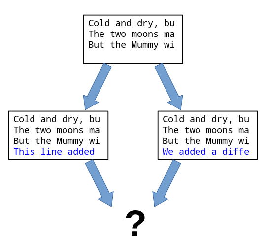

> ## Learning Objectives 
>
> *   Be able to fork a repository on GitHub.
> *   Add and use remotes.
> *   Learn how to submit a pull request.
> *   Identify tickets on open source projects.

### Forking and Remotes
We can use GitHub's idea of [Forking](https://help.github.com/articles/fork-a-repo/)
and [Remotes](https://help.github.com/articles/about-remote-repositories/)
to see how we can collaborate with projects in a way that allows us
to contribute back in a more elegant way.

Open a webbrowser and navigate to github. Log in as yourself.
Now, navigate to [https://github.com/rachelslaybaugh/planets](https://github.com/rachelslaybaugh/planets) and click the "Fork" button.

This will create a copy of my repository under your username 
(you can rename it so you don't cause conflicts with your existing planets directory).

Now, open your shell, 
navigate to the location where you are doing work for this class,
clone the repository that you just forked from me,
and enter that repository.

We will also add a [Remote](https://help.github.com/articles/about-remote-repositories/). 
This information tells git where our "remote" repository is located and that
we want to call that remote "origin". 

On the command line type  `git remote -v`

~~~
$ git remote -v
origin	git@github.com:rachelslaybaugh/planets.git (fetch)
origin	git@github.com:rachelslaybaugh/planets.git (push)
~~~ 

We can also connect our repository to multiple remotes so 
that we can keep things in sync with other repositories.
In this case,  we want to connect your repository to mine,
which will allow you to get any changes I make 
and for you to contribute changes back.

We will call this remote "upstream" to indicate that it is upstream from 
your repository (this is a common practice for forked repositories).

~~~
$ git remote add upstream https://github.com/rachelslaybaugh/planets.git
$ git remote -v 
origin	git@github.com:rachelslaybaugh/planets.git (fetch)
origin	git@github.com:rachelslaybaugh/planets.git (push)
upstream	https://github.com/rachelslaybaugh/planets.git (fetch)
upstream	https://github.com/rachelslaybaugh/planets.git (push)
~~~

Now the repository on your local computer is connected to both
your github online repository (origin) and 
my github online repository (upstream). 

### Creating Conflicts
The file `mars.txt` currently looks like this
in both copies of our `planets` repository:

~~~ {.bash}
$ cat mars.txt
~~~
~~~ {.output}
Cold and dry, but everything is my favorite color
The two moons may be a problem for Wolfman
But the Mummy will appreciate the lack of humidity
~~~

Let's add a line to your copy only:

~~~ {.bash}
$ nano mars.txt
$ cat mars.txt
~~~
~~~ {.output}
Cold and dry, but everything is my favorite color
The two moons may be a problem for Wolfman
But the Mummy will appreciate the lack of humidity
This line added to Wolfman's copy
~~~

and then push the change to GitHub:

~~~ {.bash}
$ git add mars.txt
$ git commit -m "Adding a line in our home copy"
~~~
~~~ {.output}
[master 5ae9631] Adding a line in our home copy
 1 file changed, 1 insertion(+)
~~~
~~~ {.bash}
$ git push origin master
~~~
~~~ {.output}
Counting objects: 5, done.
Delta compression using up to 4 threads.
Compressing objects: 100% (3/3), done.
Writing objects: 100% (3/3), 352 bytes, done.
Total 3 (delta 1), reused 0 (delta 0)
To https://github.com/viorica/planets
   29aba7c..dabb4c8  master -> master
~~~

Now I'll make a different change to my copy
*without* updating from GitHub:

~~~ {.bash}
$ nano mars.txt
$ cat mars.txt
~~~
~~~ {.output}
Cold and dry, but everything is my favorite color
The two moons may be a problem for Wolfman
But the Mummy will appreciate the lack of humidity
We added a different line in the other copy
~~~

We can commit the change locally:

~~~ {.bash}
$ git add mars.txt
$ git commit -m "Adding a line in my copy"
~~~
~~~ {.output}
[master 07ebc69] Adding a line in my copy
 1 file changed, 1 insertion(+)
~~~

but Git won't let us push it to GitHub:

~~~ {.bash}
$ git push origin master
~~~
~~~ {.output}
To https://github.com/viorica/planets.git
 ! [rejected]        master -> master (non-fast-forward)
error: failed to push some refs to 'https://github.com/viorica/planets.git'
hint: Updates were rejected because the tip of your current branch is behind
hint: its remote counterpart. Merge the remote changes (e.g. 'git pull')
hint: before pushing again.
hint: See the 'Note about fast-forwards' in 'git push --help' for details.
~~~

Git detects that the changes made in one copy overlap with those made in the other
and stops us from trampling on our previous work.
What we have to do is pull the changes from GitHub,
[merge](reference.html#merge) them into the copy we're currently working in,
and then push that.
Let's start by pulling:

~~~ {.bash}
$ git pull origin master
~~~
~~~ {.output}
remote: Counting objects: 5, done.        
remote: Compressing objects: 100% (2/2), done.        
remote: Total 3 (delta 1), reused 3 (delta 1)        
Unpacking objects: 100% (3/3), done.
From https://github.com/viorica/planets
 * branch            master     -> FETCH_HEAD
Auto-merging mars.txt
CONFLICT (content): Merge conflict in mars.txt
Automatic merge failed; fix conflicts and then commit the result.
~~~

`git pull` tells us there's a conflict,
and marks that conflict in the affected file:

~~~ {.bash}
$ cat mars.txt
~~~
~~~ {.output}
Cold and dry, but everything is my favorite color
The two moons may be a problem for Wolfman
But the Mummy will appreciate the lack of humidity
<<<<<<< HEAD
We added a different line in the other copy
=======
This line added to Wolfman's copy
>>>>>>> dabb4c8c450e8475aee9b14b4383acc99f42af1d
~~~

Our change---the one in `HEAD`---is preceded by `<<<<<<<`.
Git has then inserted `=======` as a separator between the conflicting changes
and marked the end of the content downloaded from GitHub with `>>>>>>>`.
(The string of letters and digits after that marker
identifies the revision we've just downloaded.)

It is now up to us to edit this file to remove these markers
and reconcile the changes.
We can do anything we want: keep the change made in the local repository, keep
the change made in the remote repository, write something new to replace both,
or get rid of the change entirely.
Let's replace both so that the file looks like this:

~~~ {.bash}
$ cat mars.txt
~~~
~~~ {.output}
Cold and dry, but everything is my favorite color
The two moons may be a problem for Wolfman
But the Mummy will appreciate the lack of humidity
We removed the conflict on this line
~~~

To finish merging,
we add `mars.txt` to the changes being made by the merge
and then commit:

~~~ {.bash}
$ git add mars.txt
$ git status
~~~
~~~ {.output}
# On branch master
# All conflicts fixed but you are still merging.
#   (use "git commit" to conclude merge)
#
# Changes to be committed:
#
#	modified:   mars.txt
#
~~~
~~~ {.bash}
$ git commit -m "Merging changes from GitHub"
~~~
~~~ {.output}
[master 2abf2b1] Merging changes from GitHub
~~~

Now we can push our changes to GitHub:

~~~ {.bash}
$ git push origin master
~~~
~~~ {.output}
Counting objects: 10, done.
Delta compression using up to 4 threads.
Compressing objects: 100% (6/6), done.
Writing objects: 100% (6/6), 697 bytes, done.
Total 6 (delta 2), reused 0 (delta 0)
To https://github.com/viorica/planets.git
   dabb4c8..2abf2b1  master -> master
~~~

Git keeps track of what we've merged with what,
so we don't have to fix things by hand again
when the collaborator who made the first change pulls again:

~~~ {.bash}
$ git pull origin master
~~~
~~~ {.output}
remote: Counting objects: 10, done.        
remote: Compressing objects: 100% (4/4), done.        
remote: Total 6 (delta 2), reused 6 (delta 2)        
Unpacking objects: 100% (6/6), done.
From https://github.com/viorica/planets
 * branch            master     -> FETCH_HEAD
Updating dabb4c8..2abf2b1
Fast-forward
 mars.txt | 2 +-
 1 file changed, 1 insertion(+), 1 deletion(-)
~~~

we get the merged file:

~~~ {.bash}
$ cat mars.txt 
~~~
~~~ {.output}
Cold and dry, but everything is my favorite color
The two moons may be a problem for Wolfman
But the Mummy will appreciate the lack of humidity
We removed the conflict on this line
~~~

We don't need to merge again because Git knows someone has already done that.

Version control's ability to merge conflicting changes
is another reason users tend to divide their programs and papers into multiple files
instead of storing everything in one large file.
There's another benefit too:
whenever there are repeated conflicts in a particular file,
the version control system is essentially trying to tell its users
that they ought to clarify who's responsible for what,
or find a way to divide the work up differently.

and making [Pull Requests](https://help.github.com/articles/using-pull-requests/) on GitHub.

## Try the challenges below.

> ## Solving Conflicts that You Create 
>
> Clone the repository created by your instructor.
> Add a new file to it,
> and modify an existing file (your instructor will tell you which one).
> When asked by your instructor,
> pull her changes from the repository to create a conflict,
> then resolve it.

> ## Conflicts on Non-textual files
>
> What does Git do
> when there is a conflict in an image or some other non-textual file
> that is stored in version control?
