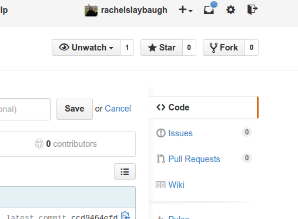
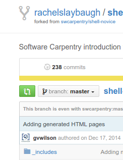
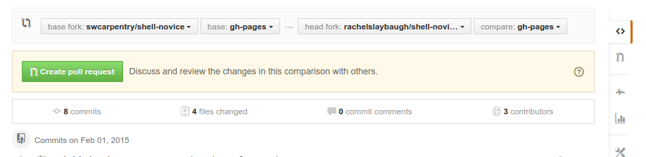

> ## Learning Objectives 
>
> *   Be able to fork a repository on GitHub.
> *   Add and use remotes.
> *   Learn how to submit a pull request.
> *   Identify tickets on open source projects.

### Forking and Remotes
We can use GitHub's ideas of [Forking](https://help.github.com/articles/fork-a-repo/)
and [Remotes](https://help.github.com/articles/about-remote-repositories/)
to see how we can collaborate with projects in a way that allows us
to contribute back more elegantly than we did in lesson 3.

Open a webbrowser, navigate to [GitHub](https://github.com/), and log in. 
Now, navigate to [https://github.com/rachelslaybaugh/planets](https://github.com/rachelslaybaugh/planets) 
and click the "Fork" button in the upper right hand corner.

This will create a *copy* of my repository under your username; 
that is, it will be owned by you 
(you can rename it so you don't cause conflicts with your existing planets directory).

Next, open your shell, 
navigate to the location where you are doing work for this class,
clone the repository that you just forked from me,
and enter that repository.

But how does git know that your local repository is connected to an online repository?
Git uses what is called a [Remote](https://help.github.com/articles/about-remote-repositories/) to keep track of these connections. 
This information tells git where our "remote" repository is located,
and each remote repository has a name. 
The general convention is that your base repository is called "origin";
git will automatically give our GitHub connection this name upon cloning.

On the command line type `git remote -v`.

~~~
$ git remote -v
origin	https://github.com/<yourname>/planets.git (fetch)
origin	https://github.com/<yourname>/planets.git (push)
~~~ 

We can see that the connection is to your repository 
and that it has been named origin. 
The fetch and push designators mean that it is a two-way connection.

> A remote doesn't have to be on the internet.
> A remote could be hosted on a server at a laboratory,
> on someone else's computer on a network, etc.
> In the case of using GitHub it is obviously online.

We can also connect our repository to *other remotes* so 
that we can keep things in sync with other repositories.
In this case,  we want to connect your repository to mine.
This will allow you to get any changes I make 
and for you to (potentially) contribute changes back.

We will use the `remote add` command and 
call this remote "upstream" to indicate that it is upstream from 
your repository (this nomenclature is common for forked repositories).

~~~
$ git remote add upstream https://github.com/rachelslaybaugh/planets.git
$ git remote -v 
origin  https://github.com/<yourname>/planets.git (fetch)
origin  https://github.com/<yourname>/planets.git (push)
upstream https://github.com/rachelslaybaugh/planets.git (fetch)
upstream https://github.com/rachelslaybaugh/planets.git (push)
~~~

Now the repository on your local computer is connected to both
*your* github online repository (`origin`) and 
*my* github online repository (`upstream`). 

### Getting Changes
One of the main reasons to connect to my repository is so you can
get changes that I make. 
We use the process of `fetch` and `merge` to get the upstream changes
into your local version. 

`fetch` will download any changes from a remote repository, 
updating your repository data,
but leaving your local repository unchanged.
One reason to do this is that you can checkout the changes made remotely
prior to combining them with your local repository.

`merge` joins two development histories together. 
This operation preserves the ancestry of each commit from 
both the local and remote repositories. 
A merge would take your repository from the first image to the second image.

Once Rachel has indicated that she has made changes to the remote repository,
get those changes for your local repository:

~~~
$ git fetch upstream
remote: Counting objects: 75, done.
 remote: Compressing objects: 100% (53/53), done.
 remote: Total 62 (delta 27), reused 44 (delta 9)
 Unpacking objects: 100% (62/62), done.
 From https://github.com/ORIGINAL_OWNER/ORIGINAL_REPOSITORY
  * [new branch]      master     -> upstream/master
~~~

This will get everytying that's been changed in Rachel's online version.
We'll largely skip over [branches] (https://www.atlassian.com/git/tutorials/using-branches/),
but for good measure make sure you're on the master branch.
This should give you output like that below.

~~~
$ git checkout master

Already on 'master'
Your branch is up-to-date with 'origin/master'.
~~~

Next, merge in the changes. 
We will tell git to merge the information from the upstream remote
on the master branch into our local copy of the master branch.
The command will look be `git merge <remote>/<branch>`.
If everything goes well, it should look like something like

~~~
$ git merge upstream/master

Updating a422352..5fdff0f
 Fast-forward
  mars.txt                    |    9 -------
  mars.md                     |    7 ++++++
  2 files changed, 7 insertions(+), 9 deletions(-)
  delete mode 100644 mars.txt
  create mode 100644 mars.md
~~~

If you made a change that caused a conflict, you will instead get something that looks like

~~~
$ git merge upstream/master
Auto-merging 03-pipefilter.md
CONFLICT (content): Merge conflict in pluto.txt
Auto-merging pluto.txt
CONFLICT (content): Merge conflict in mars.txt
Auto-merging mars.txt
Automatic merge failed; fix conflicts and then commit the result.
~~~

Now you need to resolve the conflicts by editing the files that are in conflict,
adding those files, and then commiting them. 

> Note that a `pull` is git simply doing a `fetch` and `merge` for you.
> If you know you're comfortable with the remote changes, 
> you can just `pull` directly and not bother with the intermediate steps.

Finally, you'd like those changes to be pushed up to your remote repository, origin.
This is just like what we did before.

~~~
$ git push origin master

Counting objects: 5, done.
Delta compression using up to 4 threads.
Compressing objects: 100% (3/3), done.
Writing objects: 100% (3/3), 1.56 KiB | 0 bytes/s, done.
Total 3 (delta 2), reused 0 (delta 0)
To https://github.com/<yourname>/planets.git
   bf7c645..30ec767  master -> master
~~~

Version control's ability to fetch and merge changes from other
repositories is very powerful. 
This allows us to work effectively in groups by having our own
copy of things while keeping up with a source copy of things.

### Exercise: push a change to GitHub
1. Edit `mars.md`. 
Add one sentence to the file that is about Mars.

2. Add a file to the repository called `lessons.txt` or `lessons.md`. 
In that file tell me about one thing you've learned in this lesson so far.
I'd also appreciate any feedback you have about this lesson:
how to make it clearer, what works, what doesn't work.

3. Git add and commit those changes, 
and push them to your GitHub (origin) repository.

This will update your GitHub fork with any changes you've committed.
Once you do this, you can see your changes on the GitHub web interface
to your repository, along with the time you made the change and
your commit message.

If you have permission to push to the upstream repository, sending
commits to that remote is exactly analagous.

    $ git push upstream master

In the case of the upstream push, this won't success because I haven't
given you push permission. You're welcome to try it though. 

### Contributing Back
Now you know how to get changes *from* upstream,
but what if you want to contribute changes *to* upstream?
The way to do that on GitHub is by making a
[Pull Requests](https://help.github.com/articles/using-pull-requests/).
This is a bundle of updates to the repository
that can be accepted and merged into the upstream repository or rejected
and not merged. 

To share your changes with the
upstream repository, click the green "compare and review" button on the upper
left of the GitHub interface for your forked repository (first picture below),
and GitHub will show you a summary of your commits.  
Make sure that you're comparing the correct
"base" and "head"--in this case `rachelslaybaugh/planets` and `master`
to `<yourname>/planets` and `master`. (This time this is simple, but it's
good practice to check for when you have a case that is more complex.)
If you then click on "Create pull request" (second picture below) your
request will be sent to the upstream repository for acceptance or
rejection.

> The concepts of Fork and Pull Request are unique to GitHub.
> There are other ways to handle the workflow we will cover here, 
> but for now we'll stick to GitHub's method.
>
> The concepts of Remotes, fetch, merge, and pull are part of git
> and are not unique to GitHub.

## Try the challenge below

> ## Creating a Pull Request
>
> Complete the exercise above.
> Submit a pull request to my planets repository. 
>
> I will use that pull request to measure successful completion of this assignment.

